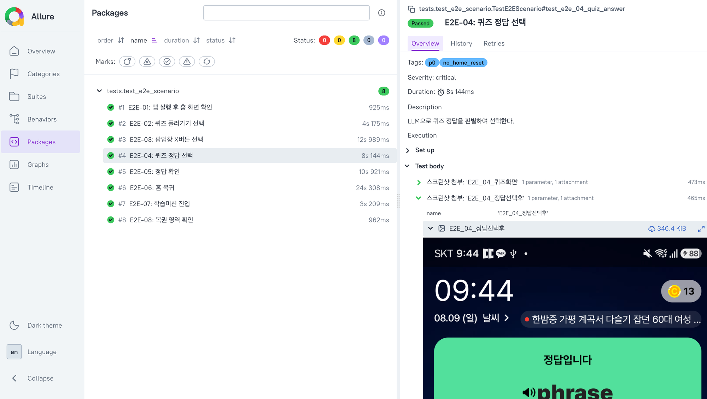

# triggers-auto

모바일 앱 **똑똑보카**의 핵심 기능을 E2E 자동화 테스트로 검증하는 프로젝트입니다.

## 데모

[](https://youtube.com/shorts/MnA_J-NiQW0)

## 프로젝트 목적

- 똑똑보카 앱의 **핵심 사용자 시나리오**를 자동화된 방식으로 검증
- 로컬 LLM(Ollama + gemma3)을 활용하여 **퀴즈 정답을 자동 판별**
- Appium 기반 모바일 앱 자동화 + AI 퀴즈 풀이 파이프라인 구축

## 구조

```
triggers-auto/
├── config/
│   └── settings.py              # Appium caps, 환경설정
├── pages/
│   ├── base_page.py             # POM 기본 클래스
│   ├── home_page.py             # 홈 화면 셀렉터
│   ├── course_page.py           # 코스 선택 셀렉터
│   └── notification_page.py     # 알림 셀렉터
├── tests/
│   └── test_e2e_scenario.py     # ★ E2E 시나리오 (메인)
├── utils/
│   └── screen_dumper.py         # 화면 덤프 유틸
├── conftest.py                  # pytest fixture (드라이버, 홈 보장, 스크린샷)
├── pytest.ini                   # pytest 설정
├── requirements.txt             # 의존성
└── run_tests.sh                 # 테스트 실행 스크립트
```

## 테스트 흐름

```
앱 실행 → 홈 화면 확인 → 퀴즈 진입 → LLM 정답 판별 → 정답 선택 → 결과 확인 → 홈 복귀 → 부가 기능 검증
```

## E2E 시나리오

| # | 시나리오 | 설명 |
|---|---------|------|
| E2E-01 | 앱 실행 후 홈 화면 확인 | 홈 화면 텍스트 요소 표시 확인 |
| E2E-02 | 퀴즈 풀러가기 선택 | 홈에서 퀴즈 진입. 하루 퀴즈 완료 시 자동 스킵 |
| E2E-03 | 팝업창 X버튼 선택 | 복권 팝업 닫기 → 잠금화면 퀴즈 노출 |
| E2E-04 | 퀴즈 정답 선택 (LLM) | Ollama gemma3로 정답 판별 → 정답 탭 |
| E2E-05 | 정답 확인 | "정답입니다" 또는 "암기완료" 텍스트 확인 |
| E2E-06 | 홈 복귀 | 홈 버튼 탭 → 홈 화면 확인 |
| E2E-07 | 학습미션 진입 | 학습미션 화면 "매일 보상받기" 확인 |
| E2E-08 | 복권 영역 확인 | 홈에서 "꽝없는 복권", "복권 긁기" 표시 확인 |

## LLM 퀴즈 정답 판별

- **Ollama gemma3** (로컬 LLM) 사용 — 외부 API 비용 0원
- **범용 프롬프트 방식**: 문제 유형 분기 없이 화면 텍스트를 통째로 LLM에 전달
- 대응 가능 퀴즈 유형 (코드 수정 없이 자동 대응):
  - 영단어 → 한국어 뜻 고르기
  - 한국어 뜻 → 영단어 고르기
  - 빈칸 채우기
  - 기타 새로운 유형

```
화면 XML 파싱 → 문제/보기 추출 → LLM 정답 판별 → 보기 매칭 → 정답 탭
```

## 결과 리포트

테스트 실행 후 Allure 리포트가 생성됩니다.



## 기술 스택

- **Python** — 메인 언어
- **Appium + UiAutomator2** — Android 앱 자동화
- **pytest + Allure** — 테스트 프레임워크 + 리포트
- **Ollama (gemma3)** — 로컬 LLM 퀴즈 정답 판별
- **POM (Page Object Model)** — 테스트 코드 구조화
- **ADB** — Android 기기 연결
